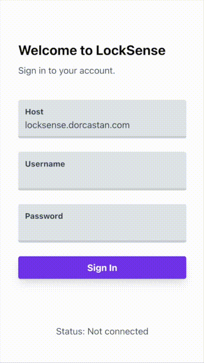
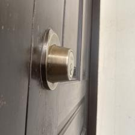
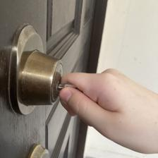

# LockSense Mobile

LockSense is a (prototype) home security system that detects lock-picking via audio and visual data and sends relevant alerts to homeowners.

This web application is LockSense's user interface. It provides a convenient way to stream photos from a phone camera and allows users to receive pop-up alerts when a door lock is picked or unlocked.

> Note: Unfortunately, live testing this system is not possible as we are no longer running most of its backend services.

## App Overview

## Examples of Detectable Activity

| No activity | Door unlocking | Lock picking |
|---|---|---|
|  |  |  |

Refer to https://github.com/LockSense/locksense-ml for details of the machine learning model.
